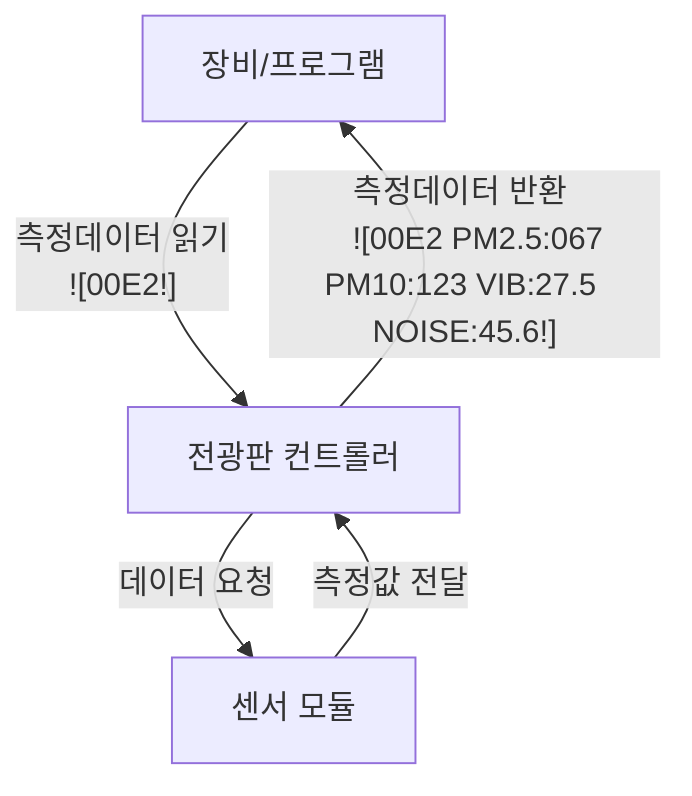

## 개요

전광판 컨트롤러에 연결된 4종류의 센서(미세먼지, 초미세먼지, 진동센서, 소음기)로부터 측정된 데이터를 한번에 읽어오는 프로토콜입니다.

## 데이터 수집 흐름도

전광판 컨트롤러는 `![00E2!]` 명령을 수신하면, 연결된 센서(미세먼지, 초미세먼지, 진동, 소음기) 데이터를 포함한 **응답 패킷**을 반환합니다. 이 패킷을 기반으로 자체 PC 프로그램, 로깅 장비, 혹은 분석 시스템을 구성하여 센서 데이터를 확인할 수 있습니다.

**제공하는 프로토콜 문서를 기반으로 직접 데이터 시각화 및 모니터링 프로그램을 제작**할 수 있으며, 이를 통해 실시간 데이터 확인, 기록 등의 시스템을 유연하게 구현할 수 있습니다.




### 지원 센서 타입

1. **미세먼지 센서** (DUST_TYPE_PM): PM2.5, PM10 실제 측정값
   - **통신 포트**: TTL 포트 (COMM_PORT_TTL)
2. **초미세먼지 센서** (DUST_TYPE_ULTRA_PM): PM10 기준 계산된 PM2.5 값
   - **통신 포트**: TTL 포트 (COMM_PORT_TTL)
3. **진동센서** (DUST_TYPE_VIBRATION): Z축 진동값 (dBV 단위)
   - **통신 포트**: RS-232 포트 (COMM_PORT_232)
4. **소음기** (DUST_TYPE_NOISE): 소음값 (dBA 단위)
   - **통신 포트**: RS-232 포트 (COMM_PORT_232)

---

## ASCII Protocol

### 명령 패킷

#### 측정 데이터 읽기

- **송신 패킷**: `![00E2!]`
	- RS485 통신의 경우 첫번째자리가 Address로 1~F까지의 값
	- 예. Address 1: `![10E2!]`, Address 15: `![F0E2!]` 
- **응답 패킷**: `![00E2 PM2.5:XXX PM10:XXX VIB:XX.X NOISE:XX.X!]`

**응답 패킷 구조**:

- `PM2.5:XXX`: PM2.5 측정값 (3자리 정수)
- `PM10:XXX`: PM10 측정값 (3자리 정수)
- `VIB:XX.X` 또는 `VIB:XXX`: 진동값 (소수점 또는 정수)
- `NOISE:XX.X` 또는 `NOISE:XXX`: 소음값 (소수점 또는 정수)

---

## 센서별 응답 예시

### 1. 미세먼지 시스템 (DUST_TYPE_PM)

```
송신: ![00E2!]
응답: ![00E2 PM2.5:067 PM10:123 VIB:000 NOISE:000!]
```

**특징**:

- PM2.5, PM10: 실제 센서 측정값 사용
- VIB, NOISE: 0으로 고정 (미사용)
- 데이터 형식: 3자리 정수

### 2. 초미세먼지 시스템 (DUST_TYPE_ULTRA_PM)

```
송신: ![00E2!]
응답: ![00E2 PM2.5:089 PM10:156 VIB:000 NOISE:000!]
```

**특징**:

- PM2.5: PM10 값을 기준으로 계산된 값
- PM10: 실제 센서 측정값
- VIB, NOISE: 0으로 고정 (미사용)

### 3. 진동센서 시스템 (DUST_TYPE_VIBRATION)

```
송신: ![00E2!]
응답: ![00E2 PM2.5:000 PM10:000 VIB:27.5 NOISE:000!]
```

**특징**:

- PM2.5, PM10: 0으로 고정 (미사용)
- VIB: 진동 측정값 (dBV 단위)
- NOISE: 0으로 고정 (미사용)

**진동값 표시 형식**:

- 정수부가 2자리면: `XX.X` (소수점 포함)
- 정수부가 3자리면: `XXX` (정수만)

### 4. 소음기 시스템 (DUST_TYPE_NOISE)

```
송신: ![00E2!]
응답: ![00E2 PM2.5:000 PM10:000 VIB:000 NOISE:45.6!]
```

**특징**:

- PM2.5, PM10: 0으로 고정 (미사용)
- VIB: 0으로 고정 (미사용)
- NOISE: 소음 측정값 (dBA 단위)

**소음값 표시 형식**:

- 정수부가 2자리면: `XX.X` (소수점 포함)
- 정수부가 3자리면: `XXX` (정수만)

---

## 응답 패킷 상세

### 패킷 길이

- **고정 부분**: `![00E2 ` (7바이트)
- **PM2.5 부분**: `PM2.5:XXX ` (10바이트)
- **PM10 부분**: `PM10:XXX ` (9바이트)
- **VIB 부분**: `VIB:XXX ` 또는 `VIB:XX.X ` (8-9바이트)
- **NOISE 부분**: `NOISE:XXX` 또는 `NOISE:XX.X` (9-10바이트)
- **종료 부분**: `!]` (2바이트)

**총 길이**: 약 45-47바이트

### 문자 인코딩

- ASCII 문자만 사용
- 숫자는 '0'-'9' 문자로 표현
- 소수점은 '.' 문자 사용

---

## 사용 시나리오

### 1. 실시간 모니터링

```
주기적으로 ![00E2!] 명령을 전송하여 모든 센서 데이터를 한번에 수집
```

### 2. 데이터 로깅

```
측정된 데이터를 파싱하여 데이터베이스나 파일에 저장
```

### 3. 시스템 상태 확인

```
각 센서의 동작 상태를 확인 (0이 아닌 값으로 동작 여부 판단)
```

---

## 주의사항

1. **센서 타입 확인**: 시스템에 설정된 `DUST_MEASUREMENT_TYPE`에 따라 유효한 데이터가 다름
2. **데이터 유효성**: 0값은 해당 센서가 비활성화되었거나 데이터가 없음을 의미
3. **응답 길이**: 가변 길이이므로 파싱 시 주의 필요
4. **소수점 처리**: 진동/소음값은 조건에 따라 소수점 포함 여부가 달라짐

---

## 에러 처리

### 명령 실패 시

```
송신: ![00E2!]
응답: ![00E2F!]  # 'F' = Fail
```

**실패 원인**:

- 시스템 오류
- 센서 데이터 없음
- 메모리 부족

---

### 테스트 방법

```
// 테스트 명령 전송
![00E2!]

// 예상 응답 (미세먼지 시스템)
![00E2 PM2.5:067 PM10:123 VIB:000 NOISE:000!]
```

