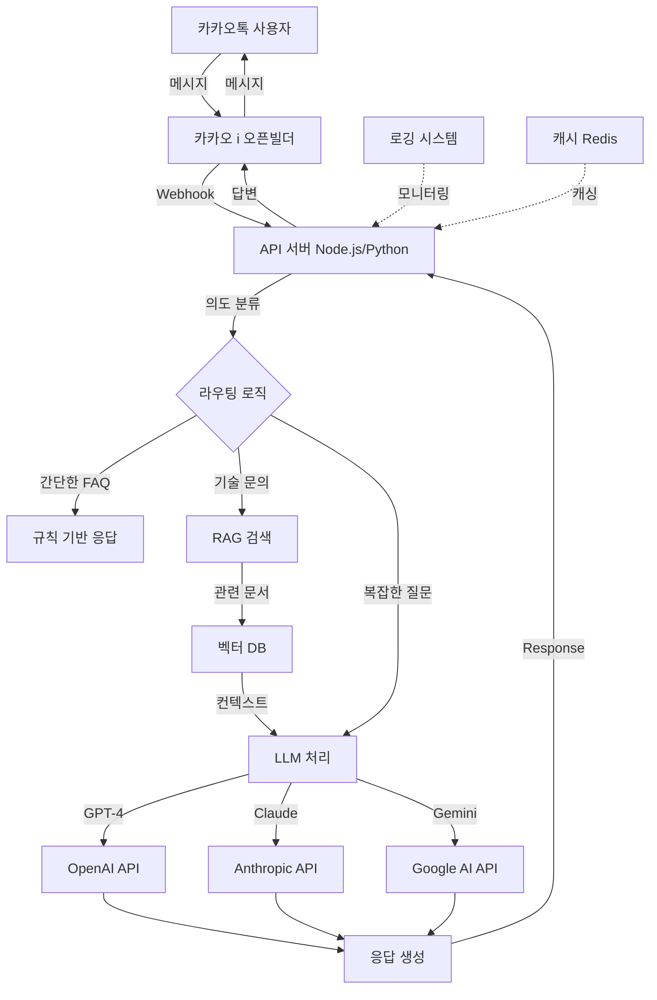

# 카카오톡 챗봇에 LLM 연동 완벽 가이드

> 카카오 i 오픈빌더 챗봇에 OpenAI, Claude, Gemini 등 LLM을 연동하여 지능형 대화 시스템을 구축하는 완전한 가이드

---

## 📋 목차

1. [LLM 연동 개요](#llm-연동-개요)
2. [아키텍처 설계](#아키텍처-설계)
3. [OpenAI GPT 연동](#openai-gpt-연동)
4. [Claude 연동](#claude-연동)
5. [Gemini 연동](#gemini-연동)
6. [RAG 시스템과 LLM 결합](#rag-시스템과-llm-결합)
7. [프롬프트 엔지니어링](#프롬프트-엔지니어링)
8. [비용 최적화](#비용-최적화)
9. [보안 및 모니터링](#보안-및-모니터링)

---

## LLM 연동 개요

### 왜 LLM을 연동해야 하나요?

**카카오 i 오픈빌더 기본 기능의 한계:**
- 사전 정의된 시나리오와 블록 구조에 의존
- 예상치 못한 질문에 대응 어려움
- 자연스러운 대화 흐름 구현 제한적
- 복잡한 문맥 이해 불가능

**LLM 연동 시 장점:**
- ✅ 자연어 이해 및 생성 능력 대폭 향상
- ✅ 예측 불가능한 질문에도 유연한 대응
- ✅ 맥락을 이해하는 멀티턴 대화
- ✅ RAG와 결합하여 정확한 기술 지원 제공
- ✅ 지속적인 학습 및 개선 가능

### LLM 선택 가이드

| LLM | 장점 | 단점 | 추천 용도 |
|-----|------|------|-----------|
| **OpenAI GPT-4** | 가장 강력한 성능, 풍부한 문서 | 비용 높음, 응답 느림 | 복잡한 기술 문의 |
| **OpenAI GPT-3.5** | 빠른 속도, 저렴한 비용 | 성능 제한적 | 간단한 FAQ |
| **Claude 3 Opus** | 긴 컨텍스트(200K), 안전성 높음 | 비용 높음 | 매뉴얼 전체 참조 |
| **Claude 3 Sonnet** | 균형잡힌 성능/비용 | - | 일반적인 고객 지원 |
| **Gemini 1.5 Pro** | 매우 긴 컨텍스트(2M), 무료 할당량 | 한국어 성능 보통 | 대용량 문서 처리 |
| **Llama 3** | 자체 호스팅, 비용 무료 | 인프라 필요, 성능 낮음 | 비용 민감한 경우 |

**다빛솔루션 추천 조합:**
- **1차 응답**: Claude 3 Sonnet (빠른 속도 + 한국어 성능)
- **복잡한 문제**: GPT-4 (정확도 최우선)
- **지식 검색**: RAG (벡터 DB) + Claude/GPT

---

## 아키텍처 설계

### 전체 시스템 구조



### 디렉토리 구조

```
dabit-chatbot-server/
├── src/
│   ├── controllers/
│   │   ├── kakaoController.js      # 카카오 웹훅 처리
│   │   └── chatController.js       # 대화 로직
│   ├── services/
│   │   ├── llmService.js           # LLM 통합 서비스
│   │   ├── openaiService.js        # OpenAI 연동
│   │   ├── claudeService.js        # Claude 연동
│   │   ├── geminiService.js        # Gemini 연동
│   │   └── ragService.js           # RAG 검색
│   ├── models/
│   │   ├── conversation.js         # 대화 이력 모델
│   │   └── knowledge.js            # 지식 베이스 모델
│   ├── utils/
│   │   ├── promptBuilder.js        # 프롬프트 생성
│   │   ├── cache.js                # 캐싱 유틸
│   │   └── logger.js               # 로깅
│   └── config/
│       ├── env.js                  # 환경 변수
│       └── prompts.js              # 프롬프트 템플릿
├── tests/
├── docs/
├── .env
├── package.json
└── README.md
```

---

## OpenAI GPT 연동

### 1. 환경 설정

#### API 키 발급
1. https://platform.openai.com/ 접속
2. 회원가입 및 로그인
3. API Keys 메뉴에서 새 키 생성
4. 결제 정보 등록 (종량제)

#### 패키지 설치
```bash
npm install openai
# 또는
pip install openai
```

#### 환경 변수 설정
```env
# .env
OPENAI_API_KEY=sk-proj-xxxxxxxxxxxxx
OPENAI_MODEL=gpt-4-turbo-preview
OPENAI_TEMPERATURE=0.7
OPENAI_MAX_TOKENS=1000
```

### 2. OpenAI Service 구현 (Node.js)

```javascript
// src/services/openaiService.js
const OpenAI = require('openai');

class OpenAIService {
    constructor() {
        this.client = new OpenAI({
            apiKey: process.env.OPENAI_API_KEY
        });
        
        this.model = process.env.OPENAI_MODEL || 'gpt-4-turbo-preview';
        this.temperature = parseFloat(process.env.OPENAI_TEMPERATURE) || 0.7;
        this.maxTokens = parseInt(process.env.OPENAI_MAX_TOKENS) || 1000;
    }

    /**
     * 단일 메시지 처리
     */
    async generateResponse(userMessage, systemPrompt = null, context = null) {
        try {
            const messages = [];
            
            // 시스템 프롬프트 추가
            if (systemPrompt) {
                messages.push({
                    role: 'system',
                    content: systemPrompt
                });
            }
            
            // 컨텍스트 추가 (RAG 검색 결과)
            if (context && context.length > 0) {
                const contextText = this._formatContext(context);
                messages.push({
                    role: 'system',
                    content: `다음은 참고할 기술 문서 내용입니다:\n\n${contextText}`
                });
            }
            
            // 사용자 메시지 추가
            messages.push({
                role: 'user',
                content: userMessage
            });
            
            console.log('[OpenAI] 요청:', {
                model: this.model,
                messageCount: messages.length
            });
            
            const response = await this.client.chat.completions.create({
                model: this.model,
                messages: messages,
                temperature: this.temperature,
                max_tokens: this.maxTokens,
                top_p: 1,
                frequency_penalty: 0,
                presence_penalty: 0
            });
            
            const answer = response.choices[0].message.content;
            const usage = response.usage;
            
            console.log('[OpenAI] 응답 완료:', {
                tokens: usage.total_tokens,
                cost: this._calculateCost(usage)
            });
            
            return {
                answer: answer,
                model: this.model,
                usage: usage,
                cost: this._calculateCost(usage)
            };
            
        } catch (error) {
            console.error('[OpenAI] 오류:', error);
            throw new Error(`OpenAI API 오류: ${error.message}`);
        }
    }

    /**
     * 대화 이력 포함 멀티턴 대화
     */
    async chat(conversationHistory, newMessage, systemPrompt = null) {
        try {
            const messages = [];
            
            // 시스템 프롬프트
            if (systemPrompt) {
                messages.push({
                    role: 'system',
                    content: systemPrompt
                });
            }
            
            // 대화 이력 추가 (최근 5턴만)
            const recentHistory = conversationHistory.slice(-5);
            messages.push(...recentHistory);
            
            // 새 메시지
            messages.push({
                role: 'user',
                content: newMessage
            });
            
            const response = await this.client.chat.completions.create({
                model: this.model,
                messages: messages,
                temperature: this.temperature,
                max_tokens: this.maxTokens
            });
            
            return {
                answer: response.choices[0].message.content,
                usage: response.usage
            };
            
        } catch (error) {
            console.error('[OpenAI Chat] 오류:', error);
            throw error;
        }
    }

    /**
     * 스트리밍 응답 (실시간 표시)
     */
    async *streamResponse(userMessage, systemPrompt = null) {
        const messages = [
            { role: 'system', content: systemPrompt || '당신은 친절한 기술 지원 AI입니다.' },
            { role: 'user', content: userMessage }
        ];
        
        const stream = await this.client.chat.completions.create({
            model: this.model,
            messages: messages,
            temperature: this.temperature,
            max_tokens: this.maxTokens,
            stream: true
        });
        
        for await (const chunk of stream) {
            const content = chunk.choices[0]?.delta?.content || '';
            if (content) {
                yield content;
            }
        }
    }

    /**
     * 컨텍스트 포맷팅
     */
    _formatContext(contextArray) {
        return contextArray.map((item, index) => {
            return `[문서 ${index + 1}]\n${item.content}\n출처: ${item.source || '매뉴얼'}`;
        }).join('\n\n---\n\n');
    }

    /**
     * 비용 계산 (GPT-4 기준)
     */
    _calculateCost(usage) {
        // GPT-4-turbo 가격 (2024년 기준)
        const inputCostPer1K = 0.01;   // $0.01 per 1K tokens
        const outputCostPer1K = 0.03;  // $0.03 per 1K tokens
        
        const inputCost = (usage.prompt_tokens / 1000) * inputCostPer1K;
        const outputCost = (usage.completion_tokens / 1000) * outputCostPer1K;
        
        return {
            total: inputCost + outputCost,
            currency: 'USD',
            breakdown: {
                input: inputCost,
                output: outputCost
            }
        };
    }

    /**
     * Function Calling (도구 사용)
     */
    async callWithFunctions(userMessage, functions) {
        const messages = [
            { role: 'user', content: userMessage }
        ];
        
        const response = await this.client.chat.completions.create({
            model: this.model,
            messages: messages,
            functions: functions,
            function_call: 'auto'
        });
        
        const message = response.choices[0].message;
        
        // Function call이 필요한 경우
        if (message.function_call) {
            return {
                type: 'function_call',
                function: message.function_call.name,
                arguments: JSON.parse(message.function_call.arguments)
            };
        }
        
        // 일반 응답
        return {
            type: 'text',
            content: message.content
        };
    }
}

module.exports = new OpenAIService();
```

### 3. Python 버전 (FastAPI)

```python
# src/services/openai_service.py
from openai import OpenAI
import os
from typing import List, Dict, Optional
import json

class OpenAIService:
    def __init__(self):
        self.client = OpenAI(api_key=os.getenv('OPENAI_API_KEY'))
        self.model = os.getenv('OPENAI_MODEL', 'gpt-4-turbo-preview')
        self.temperature = float(os.getenv('OPENAI_TEMPERATURE', '0.7'))
        self.max_tokens = int(os.getenv('OPENAI_MAX_TOKENS', '1000'))
    
    async def generate_response(
        self,
        user_message: str,
        system_prompt: Optional[str] = None,
        context: Optional[List[Dict]] = None
    ) -> Dict:
        """
        단일 메시지 처리
        """
        try:
            messages = []
            
            # 시스템 프롬프트
            if system_prompt:
                messages.append({
                    'role': 'system',
                    'content': system_prompt
                })
            
            # RAG 컨텍스트
            if context:
                context_text = self._format_context(context)
                messages.append({
                    'role': 'system',
                    'content': f'다음은 참고할 기술 문서입니다:\n\n{context_text}'
                })
            
            # 사용자 메시지
            messages.append({
                'role': 'user',
                'content': user_message
            })
            
            # API 호출
            response = self.client.chat.completions.create(
                model=self.model,
                messages=messages,
                temperature=self.temperature,
                max_tokens=self.max_tokens
            )
            
            answer = response.choices[0].message.content
            usage = response.usage
            
            return {
                'answer': answer,
                'model': self.model,
                'usage': {
                    'prompt_tokens': usage.prompt_tokens,
                    'completion_tokens': usage.completion_tokens,
                    'total_tokens': usage.total_tokens
                },
                'cost': self._calculate_cost(usage)
            }
            
        except Exception as e:
            print(f'[OpenAI] 오류: {e}')
            raise Exception(f'OpenAI API 오류: {str(e)}')
    
    async def chat(
        self,
        conversation_history: List[Dict],
        new_message: str,
        system_prompt: Optional[str] = None
    ) -> Dict:
        """
        대화 이력 포함 멀티턴 대화
        """
        messages = []
        
        if system_prompt:
            messages.append({
                'role': 'system',
                'content': system_prompt
            })
        
        # 최근 5턴만
        messages.extend(conversation_history[-5:])
        messages.append({
            'role': 'user',
            'content': new_message
        })
        
        response = self.client.chat.completions.create(
            model=self.model,
            messages=messages,
            temperature=self.temperature,
            max_tokens=self.max_tokens
        )
        
        return {
            'answer': response.choices[0].message.content,
            'usage': response.usage
        }
    
    async def stream_response(self, user_message: str, system_prompt: Optional[str] = None):
        """
        스트리밍 응답
        """
        messages = [
            {'role': 'system', 'content': system_prompt or '당신은 친절한 기술 지원 AI입니다.'},
            {'role': 'user', 'content': user_message}
        ]
        
        stream = self.client.chat.completions.create(
            model=self.model,
            messages=messages,
            temperature=self.temperature,
            max_tokens=self.max_tokens,
            stream=True
        )
        
        for chunk in stream:
            content = chunk.choices[0].delta.content
            if content:
                yield content
    
    def _format_context(self, context_array: List[Dict]) -> str:
        """컨텍스트 포맷팅"""
        formatted = []
        for i, item in enumerate(context_array):
            source = item.get('source', '매뉴얼')
            content = item.get('content', '')
            formatted.append(f'[문서 {i+1}]\n{content}\n출처: {source}')
        
        return '\n\n---\n\n'.join(formatted)
    
    def _calculate_cost(self, usage) -> Dict:
        """비용 계산"""
        input_cost_per_1k = 0.01
        output_cost_per_1k = 0.03
        
        input_cost = (usage.prompt_tokens / 1000) * input_cost_per_1k
        output_cost = (usage.completion_tokens / 1000) * output_cost_per_1k
        
        return {
            'total': input_cost + output_cost,
            'currency': 'USD',
            'breakdown': {
                'input': input_cost,
                'output': output_cost
            }
        }

# 싱글톤 인스턴스
openai_service = OpenAIService()
```

### 4. 카카오 오픈빌더 스킬 연동

```javascript
// src/controllers/kakaoController.js
const openaiService = require('../services/openaiService');
const ragService = require('../services/ragService');

/**
 * 카카오 스킬 엔드포인트
 */
exports.handleSkill = async (req, res) => {
    try {
        const userMessage = req.body.action.params.userMessage;
        const userId = req.body.userRequest.user.id;
        
        console.log(`[카카오] 사용자 ${userId}: ${userMessage}`);
        
        // 1. RAG로 관련 문서 검색
        const relevantDocs = await ragService.search(userMessage, 3);
        
        // 2. 시스템 프롬프트 생성
        const systemPrompt = `
당신은 다빛솔루션의 기술 지원 AI 어시스턴트입니다.

**회사 정보:**
- 전광판 컨트롤러 제조사
- 주요 제품: DB300, DB400, DB320WB
- 주요 고객: 주차관제, 불법주정차 단속 시스템

**응답 규칙:**
1. 친절하고 전문적으로 답변
2. 제공된 기술 문서 내용을 기반으로 답변
3. 확실하지 않으면 "상담원 연결"을 권유
4. 간결하게 3-4문장으로 답변
5. 필요시 단계별 가이드 제공

**금지 사항:**
- 없는 정보 지어내기
- 경쟁사 제품 언급
- 개인정보 요구
        `.trim();
        
        // 3. OpenAI로 응답 생성
        const result = await openaiService.generateResponse(
            userMessage,
            systemPrompt,
            relevantDocs
        );
        
        // 4. 카카오 응답 포맷
        const kakaoResponse = {
            version: '2.0',
            template: {
                outputs: [
                    {
                        simpleText: {
                            text: result.answer
                        }
                    }
                ],
                quickReplies: [
                    {
                        label: '추가 문의',
                        action: 'message',
                        messageText: '추가로 궁금한 점이 있어요'
                    },
                    {
                        label: '상담원 연결',
                        action: 'message',
                        messageText: '상담원과 통화하고 싶어요'
                    },
                    {
                        label: '처음으로',
                        action: 'block',
                        blockId: 'WELCOME_BLOCK_ID'
                    }
                ]
            }
        };
        
        // 5. 로깅
        await logConversation({
            userId,
            question: userMessage,
            answer: result.answer,
            model: result.model,
            cost: result.cost,
            timestamp: new Date()
        });
        
        res.json(kakaoResponse);
        
    } catch (error) {
        console.error('[카카오 스킬] 오류:', error);
        
        // 에러 응답
        res.json({
            version: '2.0',
            template: {
                outputs: [
                    {
                        simpleText: {
                            text: '죄송합니다. 일시적인 오류가 발생했습니다. 잠시 후 다시 시도해주세요.'
                        }
                    }
                ]
            }
        });
    }
};
```

### 5. 카카오 오픈빌더 설정

1. **스킬 서버 등록:**
   - 오픈빌더 > 설정 > 스킬 서버
   - URL: `https://your-server.com/api/kakao/skill`
   - 인증: Bearer Token 설정

2. **블록에서 스킬 호출:**
   ```
   블록 편집 > 스킬 선택 > "AI 기술문의" 스킬
   파라미터: userMessage = #{사용자발화}
   ```

3. **응답 설정:**
   - 스킬 응답 사용
   - fallback 메시지 설정

---

## Claude 연동

### 1. Claude API 설정

```javascript
// src/services/claudeService.js
const Anthropic = require('@anthropic-ai/sdk');

class ClaudeService {
    constructor() {
        this.client = new Anthropic({
            apiKey: process.env.ANTHROPIC_API_KEY
        });
        
        this.model = process.env.CLAUDE_MODEL || 'claude-3-sonnet-20240229';
        this.maxTokens = parseInt(process.env.CLAUDE_MAX_TOKENS) || 1024;
    }

    async generateResponse(userMessage, systemPrompt = null, context = null) {
        try {
            // 시스템 프롬프트 구성
            let fullSystemPrompt = systemPrompt || '당신은 친절한 기술 지원 AI입니다.';
            
            // 컨텍스트 추가
            if (context && context.length > 0) {
                const contextText = this._formatContext(context);
                fullSystemPrompt += `\n\n참고 문서:\n${contextText}`;
            }
            
            const message = await this.client.messages.create({
                model: this.model,
                max_tokens: this.maxTokens,
                system: fullSystemPrompt,
                messages: [
                    {
                        role: 'user',
                        content: userMessage
                    }
                ]
            });
            
            const answer = message.content[0].text;
            
            return {
                answer: answer,
                model: this.model,
                usage: {
                    input_tokens: message.usage.input_tokens,
                    output_tokens: message.usage.output_tokens
                },
                cost: this._calculateCost(message.usage)
            };
            
        } catch (error) {
            console.error('[Claude] 오류:', error);
            throw new Error(`Claude API 오류: ${error.message}`);
        }
    }

    async chat(conversationHistory, newMessage, systemPrompt = null) {
        try {
            // Claude는 system을 별도로 받음
            const messages = conversationHistory.slice(-5);
            messages.push({
                role: 'user',
                content: newMessage
            });
            
            const response = await this.client.messages.create({
                model: this.model,
                max_tokens: this.maxTokens,
                system: systemPrompt || '당신은 친절한 기술 지원 AI입니다.',
                messages: messages
            });
            
            return {
                answer: response.content[0].text,
                usage: response.usage
            };
            
        } catch (error) {
            console.error('[Claude Chat] 오류:', error);
            throw error;
        }
    }

    async *streamResponse(userMessage, systemPrompt = null) {
        const stream = await this.client.messages.create({
            model: this.model,
            max_tokens: this.maxTokens,
            system: systemPrompt || '당신은 친절한 기술 지원 AI입니다.',
            messages: [
                { role: 'user', content: userMessage }
            ],
            stream: true
        });
        
        for await (const event of stream) {
            if (event.type === 'content_block_delta' && 
                event.delta.type === 'text_delta') {
                yield event.delta.text;
            }
        }
    }

    _formatContext(contextArray) {
        return contextArray.map((item, index) => {
            return `<document index="${index + 1}" source="${item.source || '매뉴얼'}">\n${item.content}\n</document>`;
        }).join('\n\n');
    }

    _calculateCost(usage) {
        // Claude 3 Sonnet 가격
        const inputCostPer1M = 3.00;   // $3 per 1M tokens
        const outputCostPer1M = 15.00; // $15 per 1M tokens
        
        const inputCost = (usage.input_tokens / 1000000) * inputCostPer1M;
        const outputCost = (usage.output_tokens / 1000000) * outputCostPer1M;
        
        return {
            total: inputCost + outputCost,
            currency: 'USD',
            breakdown: {
                input: inputCost,
                output: outputCost
            }
        };
    }

    /**
     * 긴 문서 처리 (Claude의 강점 활용)
     */
    async analyzeDocument(documentText, query) {
        const systemPrompt = `
당신은 기술 문서 분석 전문가입니다.
제공된 문서를 분석하고 질문에 정확히 답변하세요.
        `.trim();
        
        const userMessage = `
다음 문서를 참고하여 질문에 답변해주세요.

<document>
${documentText}
</document>

질문: ${query}
        `.trim();
        
        return await this.generateResponse(userMessage, systemPrompt);
    }
}

module.exports = new ClaudeService();
```

### Claude 특징 및 활용 팁

**장점:**
- 200K 토큰 컨텍스트 (전체 매뉴얼 한번에 처리 가능)
- 안전하고 신뢰성 높은 응답
- 한국어 성능 우수
- XML 태그 잘 이해

**활용 사례:**
```javascript
// 전체 매뉴얼을 컨텍스트로 제공
const manualText = await loadManual('DB300_manual.pdf');
const response = await claudeService.analyzeDocument(
    manualText,
    '네트워크 설정 방법을 단계별로 알려주세요'
);
```

---

## Gemini 연동

### 1. Gemini API 설정

```javascript
// src/services/geminiService.js
const { GoogleGenerativeAI } = require('@google/generative-ai');

class GeminiService {
    constructor() {
        this.genAI = new GoogleGenerativeAI(process.env.GOOGLE_API_KEY);
        this.model = this.genAI.getGenerativeModel({ 
            model: process.env.GEMINI_MODEL || 'gemini-1.5-pro'
        });
    }

    async generateResponse(userMessage, systemPrompt = null, context = null) {
        try {
            // Gemini는 system instruction을 별도로 설정
            let model = this.model;
            
            if (systemPrompt) {
                model = this.genAI.getGenerativeModel({
                    model: 'gemini-1.5-pro',
                    systemInstruction: systemPrompt
                });
            }
            
            // 컨텍스트 포함한 프롬프트 구성
            let fullPrompt = userMessage;
            if (context && context.length > 0) {
                const contextText = this._formatContext(context);
                fullPrompt = `참고 자료:\n${contextText}\n\n질문: ${userMessage}`;
            }
            
            const result = await model.generateContent(fullPrompt);
            const response = result.response;
            const answer = response.text();
            
            return {
                answer: answer,
                model: 'gemini-1.5-pro',
                usage: {
                    // Gemini는 사용량 정보 제공 안함 (무료 할당량)
                    estimated_tokens: Math.ceil(answer.length / 4)
                }
            };
            
        } catch (error) {
            console.error('[Gemini] 오류:', error);
            throw new Error(`Gemini API 오류: ${error.message}`);
        }
    }

    async chat(conversationHistory, newMessage, systemPrompt = null) {
        try {
            const chat = this.model.startChat({
                history: this._convertHistory(conversationHistory),
                systemInstruction: systemPrompt
            });
            
            const result = await chat.sendMessage(newMessage);
            const response = result.response;
            
            return {
                answer: response.text()
            };
            
        } catch (error) {
            console.error('[Gemini Chat] 오류:', error);
            throw error;
        }
    }

    async *streamResponse(userMessage, systemPrompt = null) {
        let model = this.model;
        
        if (systemPrompt) {
            model = this.genAI.getGenerativeModel({
                model: 'gemini-1.5-pro',
                systemInstruction: systemPrompt
            });
        }
        
        const result = await model.generateContentStream(userMessage);
        
        for await (const chunk of result.stream) {
            const chunkText = chunk.text();
            yield chunkText;
        }
    }

    /**
     * 이미지 분석 (Gemini의 강점)
     */
    async analyzeImage(imageBase64, query) {
        try {
            const model = this.genAI.getGenerativeModel({ 
                model: 'gemini-1.5-pro-vision' 
            });
            
            const imageParts = [
                {
                    inlineData: {
                        data: imageBase64,
                        mimeType: 'image/jpeg'
                    }
                }
            ];
            
            const result = await model.generateContent([query, ...imageParts]);
            const response = result.response;
            
            return {
                answer: response.text()
            };
            
        } catch (error) {
            console.error('[Gemini Vision] 오류:', error);
            throw error;
        }
    }

    /**
     * 대용량 문서 처리 (2M 토큰 컨텍스트)
     */
    async processLargeDocument(documentPath, query) {
        // 파일 업로드 기능 사용
        const uploadResult = await this.genAI.uploadFile(documentPath);
        const file = uploadResult.file;
        
        const result = await this.model.generateContent([
            {
                fileData: {
                    mimeType: file.mimeType,
                    fileUri: file.uri
                }
            },
            { text: query }
        ]);
        
        return {
            answer: result.response.text()
        };
    }

    _formatContext(contextArray) {
        return contextArray.map((item, index) => {
            return `[문서 ${index + 1}] ${item.source || '매뉴얼'}\n${item.content}`;
        }).join('\n\n');
    }

    _convertHistory(history) {
        // 카카오 형식을 Gemini 형식으로 변환
        return history.map(msg => ({
            role: msg.role === 'assistant' ? 'model' : 'user',
            parts: [{ text: msg.content }]
        }));
    }
}

module.exports = new GeminiService();
```

### Gemini 특징 및 활용

**장점:**
- 2M 토큰 컨텍스트 (업계 최대)
- 무료 할당량 제공
- 멀티모달 (텍스트 + 이미지)
- 빠른 속도

**활용 사례:**
```javascript
// 고객이 보낸 에러 화면 이미지 분석
const imageAnalysis = await geminiService.analyzeImage(
    errorScreenBase64,
    '이 에러 화면을 분석하고 해결 방법을 알려주세요'
);

// 전체 매뉴얼 폴더 분석
const response = await geminiService.processLargeDocument(
    './manuals/all_manuals_combined.pdf',
    'DB300 제품의 네트워크 설정 관련 내용을 모두 찾아주세요'
);
```

---

## RAG 시스템과 LLM 결합

### RAG (Retrieval Augmented Generation) 개념

**왜 RAG가 필요한가?**
- LLM은 학습 데이터 이후의 정보를 모름
- 다빛솔루션 제품 사양, 매뉴얼 등은 LLM이 모름
- RAG로 실시간 지식 주입 가능

**RAG 작동 방식:**
```
사용자 질문 → 벡터 검색 → 관련 문서 찾기 → LLM에 컨텍스트로 제공 → 정확한 답변 생성
```

### 1. 벡터 DB 구축

```javascript
// src/services/ragService.js
const { ChromaClient } = require('chromadb');
const { OpenAIEmbeddings } = require('langchain/embeddings/openai');
const { RecursiveCharacterTextSplitter } = require('langchain/text_splitter');

class RAGService {
    constructor() {
        this.client = new ChromaClient();
        this.collectionName = 'dabit_knowledge';
        this.embeddings = new OpenAIEmbeddings({
            openAIApiKey: process.env.OPENAI_API_KEY
        });
        this.collection = null;
    }

    /**
     * 컬렉션 초기화
     */
    async initialize() {
        try {
            // 기존 컬렉션 삭제 후 재생성 (개발 중)
            try {
                await this.client.deleteCollection({ name: this.collectionName });
            } catch (e) {
                // 컬렉션이 없으면 무시
            }
            
            this.collection = await this.client.createCollection({
                name: this.collectionName,
                metadata: { 
                    description: '다빛솔루션 기술 지식 베이스',
                    created: new Date().toISOString()
                }
            });
            
            console.log('[RAG] 컬렉션 초기화 완료');
        } catch (error) {
            console.error('[RAG] 초기화 오류:', error);
            throw error;
        }
    }

    /**
     * 문서 추가 (임베딩 + 저장)
     */
    async addDocuments(documents) {
        try {
            if (!this.collection) {
                await this.initialize();
            }
            
            // 문서 분할
            const splitter = new RecursiveCharacterTextSplitter({
                chunkSize: 1000,
                chunkOverlap: 200
            });
            
            const chunks = [];
            for (const doc of documents) {
                const splits = await splitter.splitText(doc.content);
                splits.forEach((chunk, index) => {
                    chunks.push({
                        id: `${doc.id}_chunk_${index}`,
                        content: chunk,
                        metadata: {
                            ...doc.metadata,
                            chunkIndex: index,
                            source: doc.source
                        }
                    });
                });
            }
            
            // 임베딩 생성
            const texts = chunks.map(c => c.content);
            const embeddings = await this.embeddings.embedDocuments(texts);
            
            // Chroma에 저장
            await this.collection.add({
                ids: chunks.map(c => c.id),
                embeddings: embeddings,
                documents: texts,
                metadatas: chunks.map(c => c.metadata)
            });
            
            console.log(`[RAG] ${chunks.length}개 청크 추가 완료`);
            
            return {
                success: true,
                chunksAdded: chunks.length
            };
            
        } catch (error) {
            console.error('[RAG] 문서 추가 오류:', error);
            throw error;
        }
    }

    /**
     * 유사 문서 검색
     */
    async search(query, topK = 5) {
        try {
            if (!this.collection) {
                await this.initialize();
            }
            
            // 쿼리 임베딩
            const queryEmbedding = await this.embeddings.embedQuery(query);
            
            // 유사도 검색
            const results = await this.collection.query({
                queryEmbeddings: [queryEmbedding],
                nResults: topK
            });
            
            // 결과 포맷팅
            const documents = [];
            if (results.documents && results.documents[0]) {
                for (let i = 0; i < results.documents[0].length; i++) {
                    documents.push({
                        content: results.documents[0][i],
                        metadata: results.metadatas[0][i],
                        distance: results.distances[0][i],
                        relevance: this._calculateRelevance(results.distances[0][i])
                    });
                }
            }
            
            console.log(`[RAG] 검색 완료: ${documents.length}개 문서 발견`);
            
            return documents;
            
        } catch (error) {
            console.error('[RAG] 검색 오류:', error);
            return [];
        }
    }

    /**
     * 하이브리드 검색 (벡터 + 키워드)
     */
    async hybridSearch(query, topK = 5) {
        // 벡터 검색
        const vectorResults = await this.search(query, topK);
        
        // 키워드 검색 (간단한 구현)
        const keywords = this._extractKeywords(query);
        const keywordResults = await this._keywordSearch(keywords, topK);
        
        // 결과 병합 (중복 제거 + 점수 합산)
        const merged = this._mergeResults(vectorResults, keywordResults);
        
        return merged.slice(0, topK);
    }

    /**
     * 관련도 계산
     */
    _calculateRelevance(distance) {
        // 거리 -> 유사도 변환 (코사인 유사도 기준)
        // 거리가 작을수록 유사도 높음
        const similarity = 1 - distance;
        
        if (similarity > 0.8) return 'high';
        if (similarity > 0.6) return 'medium';
        return 'low';
    }

    /**
     * 키워드 추출
     */
    _extractKeywords(query) {
        // 간단한 구현: 불용어 제거 후 명사 추출
        const stopwords = ['은', '는', '이', '가', '을', '를', '에', '의'];
        const words = query.split(' ').filter(w => !stopwords.includes(w));
        return words;
    }

    /**
     * 키워드 검색
     */
    async _keywordSearch(keywords, topK) {
        // 실제로는 Elasticsearch 등 전문 검색 엔진 사용 권장
        // 여기서는 간단한 구현
        const results = await this.collection.get({
            where: {
                $or: keywords.map(keyword => ({
                    content: { $contains: keyword }
                }))
            },
            limit: topK
        });
        
        return results.documents || [];
    }

    /**
     * 결과 병합
     */
    _mergeResults(vectorResults, keywordResults) {
        const scoreMap = new Map();
        
        // 벡터 검색 결과 점수화 (가중치 0.7)
        vectorResults.forEach((doc, index) => {
            const score = (vectorResults.length - index) * 0.7;
            scoreMap.set(doc.content, {
                ...doc,
                score: score
            });
        });
        
        // 키워드 검색 결과 추가 (가중치 0.3)
        keywordResults.forEach((doc, index) => {
            const score = (keywordResults.length - index) * 0.3;
            if (scoreMap.has(doc.content)) {
                scoreMap.get(doc.content).score += score;
            } else {
                scoreMap.set(doc.content, {
                    ...doc,
                    score: score
                });
            }
        });
        
        // 점수 순으로 정렬
        return Array.from(scoreMap.values())
            .sort((a, b) => b.score - a.score);
    }
}

module.exports = new RAGService();
```

### 2. 매뉴얼 데이터 로드

```javascript
// src/utils/dataLoader.js
const fs = require('fs');
const path = require('path');
const pdf = require('pdf-parse');
const ragService = require('../services/ragService');

class DataLoader {
    /**
     * PDF 매뉴얼 로드
     */
    async loadPDFManuals(directory) {
        const files = fs.readdirSync(directory)
            .filter(f => f.endsWith('.pdf'));
        
        const documents = [];
        
        for (const file of files) {
            const filePath = path.join(directory, file);
            const dataBuffer = fs.readFileSync(filePath);
            const data = await pdf(dataBuffer);
            
            documents.push({
                id: `manual_${path.basename(file, '.pdf')}`,
                content: data.text,
                source: file,
                metadata: {
                    type: 'manual',
                    pages: data.numpages,
                    title: file.replace('.pdf', '')
                }
            });
        }
        
        return documents;
    }

    /**
     * 마크다운 문서 로드
     */
    async loadMarkdownDocs(directory) {
        const files = fs.readdirSync(directory)
            .filter(f => f.endsWith('.md'));
        
        const documents = [];
        
        for (const file of files) {
            const filePath = path.join(directory, file);
            const content = fs.readFileSync(filePath, 'utf-8');
            
            documents.push({
                id: `md_${path.basename(file, '.md')}`,
                content: content,
                source: file,
                metadata: {
                    type: 'markdown',
                    title: file.replace('.md', '')
                }
            });
        }
        
        return documents;
    }

    /**
     * FAQ 데이터 로드
     */
    async loadFAQ(jsonPath) {
        const faqData = JSON.parse(fs.readFileSync(jsonPath, 'utf-8'));
        
        const documents = faqData.map((item, index) => ({
            id: `faq_${index}`,
            content: `질문: ${item.question}\n답변: ${item.answer}`,
            source: 'FAQ',
            metadata: {
                type: 'faq',
                category: item.category,
                tags: item.tags
            }
        }));
        
        return documents;
    }

    /**
     * 전체 데이터 로드 및 RAG 구축
     */
    async buildKnowledgeBase() {
        console.log('[DataLoader] 지식 베이스 구축 시작...');
        
        try {
            // 1. 매뉴얼 로드
            const manuals = await this.loadPDFManuals('./data/manuals');
            console.log(`[DataLoader] ${manuals.length}개 매뉴얼 로드 완료`);
            
            // 2. 기술 문서 로드
            const techDocs = await this.loadMarkdownDocs('./data/tech-docs');
            console.log(`[DataLoader] ${techDocs.length}개 기술 문서 로드 완료`);
            
            // 3. FAQ 로드
            const faq = await this.loadFAQ('./data/faq.json');
            console.log(`[DataLoader] ${faq.length}개 FAQ 로드 완료`);
            
            // 4. RAG에 추가
            const allDocuments = [...manuals, ...techDocs, ...faq];
            await ragService.addDocuments(allDocuments);
            
            console.log('[DataLoader] 지식 베이스 구축 완료!');
            
            return {
                success: true,
                totalDocuments: allDocuments.length
            };
            
        } catch (error) {
            console.error('[DataLoader] 오류:', error);
            throw error;
        }
    }
}

module.exports = new DataLoader();
```

### 3. LLM + RAG 통합 서비스

```javascript
// src/services/llmService.js
const openaiService = require('./openaiService');
const claudeService = require('./claudeService');
const geminiService = require('./geminiService');
const ragService = require('./ragService');

class LLMService {
    constructor() {
        this.defaultProvider = process.env.DEFAULT_LLM || 'claude';
    }

    /**
     * 자동 라우팅 (질문 유형별 최적 LLM 선택)
     */
    async smartResponse(userMessage, conversationHistory = []) {
        // 1. 질문 유형 분석
        const questionType = this._analyzeQuestion(userMessage);
        
        // 2. RAG 검색
        const relevantDocs = await ragService.search(userMessage, 5);
        
        // 3. 적절한 LLM 선택
        let provider = this._selectProvider(questionType, relevantDocs);
        
        // 4. 시스템 프롬프트 생성
        const systemPrompt = this._buildSystemPrompt(questionType);
        
        // 5. 응답 생성
        console.log(`[LLM] ${provider} 사용 (질문 유형: ${questionType})`);
        
        let result;
        switch (provider) {
            case 'gpt4':
                result = await openaiService.generateResponse(
                    userMessage,
                    systemPrompt,
                    relevantDocs
                );
                break;
                
            case 'claude':
                result = await claudeService.generateResponse(
                    userMessage,
                    systemPrompt,
                    relevantDocs
                );
                break;
                
            case 'gemini':
                result = await geminiService.generateResponse(
                    userMessage,
                    systemPrompt,
                    relevantDocs
                );
                break;
                
            default:
                throw new Error(`지원하지 않는 LLM: ${provider}`);
        }
        
        // 6. 결과에 메타데이터 추가
        result.metadata = {
            questionType: questionType,
            provider: provider,
            relevantDocsCount: relevantDocs.length,
            sources: relevantDocs.map(d => d.metadata.source)
        };
        
        return result;
    }

    /**
     * 질문 유형 분석
     */
    _analyzeQuestion(question) {
        const patterns = {
            'technical': /설정|연결|프로토콜|통신|오류|에러|고장/,
            'product_info': /제품|사양|모델|가격|구매/,
            'howto': /어떻게|방법|가이드|튜토리얼/,
            'troubleshoot': /안됨|작동|문제|해결/,
            'general': /.*/
        };
        
        for (const [type, pattern] of Object.entries(patterns)) {
            if (pattern.test(question)) {
                return type;
            }
        }
        
        return 'general';
    }

    /**
     * 최적 LLM 선택
     */
    _selectProvider(questionType, relevantDocs) {
        // 문서 관련도 확인
        const hasHighRelevance = relevantDocs.some(d => d.relevance === 'high');
        
        // 선택 로직
        if (questionType === 'technical' && hasHighRelevance) {
            // 기술 문의 + 관련 문서 있음 → Claude (긴 컨텍스트)
            return 'claude';
        } else if (questionType === 'troubleshoot') {
            // 문제 해결 → GPT-4 (추론 능력)
            return 'gpt4';
        } else if (!hasHighRelevance) {
            // 관련 문서 없음 → Gemini (일반 지식)
            return 'gemini';
        } else {
            // 기본
            return this.defaultProvider;
        }
    }

    /**
     * 시스템 프롬프트 생성
     */
    _buildSystemPrompt(questionType) {
        const basePrompt = `
당신은 다빛솔루션의 AI 기술 지원 어시스턴트입니다.

**회사 정보:**
- 전광판 컨트롤러 전문 제조사
- 주요 제품: DB300, DB400, DB320WB
- 주요 분야: 주차관제, 불법주정차 단속

**응답 원칙:**
1. 친절하고 전문적인 톤
2. 제공된 문서 기반으로 정확한 답변
3. 불확실하면 솔직히 "확인이 필요합니다" 표현
4. 간결하게 3-5문장으로 답변
5. 필요시 단계별 가이드 제공
        `.trim();
        
        const typeSpecificPrompts = {
            'technical': '\n\n**특별 지시:** 기술적으로 정확한 용어를 사용하되, 고객이 이해하기 쉽게 설명하세요.',
            'troubleshoot': '\n\n**특별 지시:** 문제 해결을 위한 단계별 진단 절차를 제시하세요.',
            'howto': '\n\n**특별 지시:** 따라하기 쉬운 단계별 가이드를 제공하세요.',
            'product_info': '\n\n**특별 지시:** 제품 스펙과 특징을 명확히 설명하세요.'
        };
        
        return basePrompt + (typeSpecificPrompts[questionType] || '');
    }

    /**
     * 폴백 처리 (에러 시 다른 LLM 시도)
     */
    async responseWithFallback(userMessage, conversationHistory = []) {
        const providers = ['claude', 'gpt4', 'gemini'];
        
        for (const provider of providers) {
            try {
                console.log(`[LLM] ${provider} 시도 중...`);
                
                const service = this._getService(provider);
                const relevantDocs = await ragService.search(userMessage, 3);
                const systemPrompt = this._buildSystemPrompt('general');
                
                const result = await service.generateResponse(
                    userMessage,
                    systemPrompt,
                    relevantDocs
                );
                
                result.provider = provider;
                return result;
                
            } catch (error) {
                console.error(`[LLM] ${provider} 실패:`, error.message);
                continue;
            }
        }
        
        throw new Error('모든 LLM 제공자 실패');
    }

    _getService(provider) {
        switch (provider) {
            case 'gpt4':
                return openaiService;
            case 'claude':
                return claudeService;
            case 'gemini':
                return geminiService;
            default:
                throw new Error(`Unknown provider: ${provider}`);
        }
    }
}

module.exports = new LLMService();
```

---

## 프롬프트 엔지니어링

### 다빛솔루션 최적화 프롬프트

```javascript
// src/config/prompts.js
module.exports = {
    // 기본 시스템 프롬프트
    SYSTEM_BASE: `
당신은 "다빛솔루션" 전광판 컨트롤러 전문 회사의 AI 기술 지원 어시스턴트 "다빛이"입니다.

## 회사 정보
- **회사명**: 다빛솔루션 (Dabit Solution)
- **사업 분야**: LED 전광판 컨트롤러 제조 및 기술 지원
- **주요 제품**: 
  * DB300: 일반형 컨트롤러
  * DB400: 고급형 컨트롤러
  * DB320WB: WiFi/Bluetooth 통합 모델
- **주요 고객**: 주차관제 시스템, 불법주정차 단속, 교통 정보 시스템

## 핵심 역할
1. 제품 기술 문의 응대
2. 설치/설정 가이드 제공
3. 문제 해결 (Troubleshooting)
4. AS 접수 안내

## 응답 원칙
✅ **DO (해야 할 것)**
- 친절하고 전문적인 톤 유지
- 제공된 문서/매뉴얼 내용 기반 답변
- 불확실한 경우 솔직하게 "확인이 필요합니다" 표현
- 간결하게 3-5문장으로 답변
- 복잡한 내용은 단계별로 설명
- 이모지 적절히 사용 (📱 🔧 ✅ ⚠️ 등)

❌ **DON'T (하지 말아야 할 것)**
- 추측이나 지어낸 정보 제공 금지
- 경쟁사 제품 언급 금지
- 개인정보 요구 금지
- 지나치게 기술적인 전문 용어 남발 금지
- 긴 설명으로 고객 혼란시키기 금지

## 답변 형식
**기본 구조:**
1. 문제/질문 확인 ("~에 대해 문의하셨군요")
2. 핵심 답변 (2-3문장)
3. 추가 팁 또는 주의사항 (필요시)
4. 후속 질문 유도

**예시:**
"WiFi 연결 문제에 대해 문의하셨군요. 📱

먼저 제품 설정 메뉴에서 WiFi > 네트워크 검색을 실행해주세요. 공유기가 2.4GHz로 설정되어 있는지 확인이 필요하며, DB300은 5GHz를 지원하지 않습니다. 

✅ 공유기를 재부팅한 후 다시 시도해보시고, 그래도 안 되면 유선 연결로 펌웨어 업데이트를 먼저 진행해주세요.

다른 도움이 필요하신가요?"
    `.trim(),

    // 기술 문의 특화
    TECHNICAL_SUPPORT: `
당신은 기술 지원 전문가입니다. 다음 지침을 따르세요:

## 문제 진단 절차
1. **증상 확인**: 구체적으로 어떤 문제인지 파악
2. **환경 확인**: 제품 모델, 펌웨어 버전, 연결 방식
3. **기본 체크**: 전원, 연결 케이블, LED 상태
4. **단계별 해결**: 쉬운 것부터 복잡한 순서로

## 응답 템플릿
**[증상 확인]**
- 어떤 문제인지 확인

**[원인 분석]**
- 가능한 원인 1-2가지

**[해결 방법]**
1. 첫 번째 시도
2. 두 번째 시도
3. 최종 방법

**[추가 안내]**
- 해결 안 될 경우 상담원 연결 안내
    `.trim(),

    // AS 접수용
    AS_REQUEST: `
당신은 AS 접수를 도와주는 어시스턴트입니다.

## 필수 수집 정보
1. 제품 모델 (DB300/DB400/DB320WB)
2. 시리얼 번호
3. 구매 일자
4. 증상 설명
5. 연락처

## 응답 흐름
1. 정중한 인사 + AS 접수 안내
2. 필수 정보 하나씩 질문
3. 정보 확인 및 접수 완료
4. 예상 처리 시간 안내

## 톤
- 공감하는 톤 ("불편을 드려 죄송합니다")
- 신속 처리 의지 표현
- 감사 인사
    `.trim(),

    // FAQ 응답용
    FAQ_RESPONSE: `
간단한 FAQ 질문에 대한 답변입니다.

## 특징
- 짧고 명확하게
- 관련 문서 링크 제공
- 추가 질문 유도

## 형식
**답변:** [핵심 내용 1-2문장]
**참고:** [관련 매뉴얼 페이지]
**더 궁금하신 점:** [추가 질문 예시]
    `.trim(),

    // 프로토콜 설명용
    PROTOCOL_GUIDE: `
당신은 통신 프로토콜 전문가입니다.

## 설명 방식
1. **개념 설명**: 프로토콜이 무엇인지
2. **실제 예시**: 구체적인 커맨드 예시
3. **주의사항**: 자주 하는 실수

## 코드 포맷
\`\`\`
[예시 커맨드]
\`\`\`

## 구조
- 헤더/데이터/체크섬 구조 설명
- 각 바이트 의미
- BCC 계산 방법
    `.trim()
};
```

### Few-Shot 예제 프롬프트

```javascript
// 효과적인 Few-Shot 예제
const FEW_SHOT_EXAMPLES = `
## 좋은 응답 예시

**Q: WiFi가 계속 끊겨요**
**A:** WiFi 연결이 불안정하시군요. 📡

먼저 공유기와 제품 간 거리를 2-3m 이내로 가까이 해보세요. DB300은 WiFi 신호가 약하면 자동으로 연결이 끊어집니다. 

✅ **체크리스트:**
1. 공유기가 2.4GHz인지 확인
2. 다른 기기는 WiFi 잘 되는지 확인
3. 제품 설정에서 고정 IP 사용 시도

그래도 문제가 지속되면 유선(이더넷) 연결을 권장드립니다. 추가로 궁금하신 점 있으신가요?

---

**Q: ASCII 프로토콜 보내는 방법**
**A:** ASCII 프로토콜 전송 방법을 안내드리겠습니다. 🔧

다빛솔루션 제품은 다음 형식을 사용합니다:
\`\`\`
STX + ID + CMD + DATA + ETX + BCC
\`\`\`

**예시 (텍스트 표출):**
\`\`\`
02 30 30 44 54 48 65 6C 6C 6F 03 42
(02:STX, 3030:ID, 44:CMD, ...Hello..., 03:ETX, 42:BCC)
\`\`\`

📄 자세한 내용은 "DABIT DOCS > 통신 프로토콜" 매뉴얼을 참고해주세요.

테스트 도구가 필요하시면 다빛채(DabitChe) 프로그램 사용을 추천드립니다!

---

**Q: 제품 가격이 궁금해요**
**A:** 제품 가격 문의 감사합니다. 💰

제품 가격은 수량, 옵션, 납기에 따라 달라집니다. 정확한 견적은 영업팀을 통해 안내받으실 수 있습니다.

📞 **연락처:**
- 전화: 1234-5678
- 이메일: sales@dabitsolution.com
- 카카오톡: 상담원 연결 버튼 클릭

빠른 시일 내에 상담해드리겠습니다! 😊
`;
```

### 동적 프롬프트 생성

```javascript
// src/utils/promptBuilder.js
class PromptBuilder {
    constructor() {
        this.prompts = require('../config/prompts');
    }

    /**
     * 상황별 최적 프롬프트 생성
     */
    build(context) {
        const {
            questionType,
            userProfile,
            conversationHistory,
            relevantDocs,
            timeOfDay
        } = context;
        
        let prompt = this.prompts.SYSTEM_BASE;
        
        // 질문 유형별 추가
        if (questionType === 'technical') {
            prompt += '\n\n' + this.prompts.TECHNICAL_SUPPORT;
        } else if (questionType === 'as_request') {
            prompt += '\n\n' + this.prompts.AS_REQUEST;
        }
        
        // 사용자 프로필 반영
        if (userProfile) {
            prompt += `\n\n**고객 정보:**\n`;
            prompt += `- 이름: ${userProfile.name}\n`;
            prompt += `- 이전 문의: ${userProfile.previousIssues}\n`;
        }
        
        // 시간대별 인사
        const greeting = this._getTimeBasedGreeting(timeOfDay);
        prompt += `\n\n**인사말:** ${greeting}`;
        
        // 이전 대화 컨텍스트
        if (conversationHistory && conversationHistory.length > 0) {
            prompt += '\n\n**이전 대화 요약:**\n';
            prompt += this._summarizeHistory(conversationHistory);
        }
        
        return prompt;
    }

    /**
     * 시간대별 인사
     */
    _getTimeBasedGreeting(hour) {
        if (hour < 12) return '좋은 아침입니다!';
        if (hour < 18) return '안녕하세요!';
        return '안녕하세요! 늦은 시간까지 수고하십니다.';
    }

    /**
     * 대화 이력 요약
     */
    _summarizeHistory(history) {
        const recent = history.slice(-3);
        return recent.map(h => `- ${h.role}: ${h.content.substring(0, 50)}...`).join('\n');
    }

    /**
     * RAG 컨텍스트 포맷팅
     */
    formatRAGContext(documents) {
        if (!documents || documents.length === 0) {
            return null;
        }
        
        let context = '## 참고 문서\n\n';
        
        documents.forEach((doc, index) => {
            context += `### [문서 ${index + 1}] ${doc.metadata.source}\n`;
            context += `관련도: ${doc.relevance}\n\n`;
            context += `${doc.content}\n\n`;
            context += `---\n\n`;
        });
        
        return context;
    }
}

module.exports = new PromptBuilder();
```

---

## 비용 최적화

### 1. 캐싱 전략

```javascript
// src/utils/cache.js
const Redis = require('redis');

class CacheService {
    constructor() {
        this.client = Redis.createClient({
            url: process.env.REDIS_URL || 'redis://localhost:6379'
        });
        this.client.connect();
        this.defaultTTL = 3600; // 1시간
    }

    /**
     * FAQ 캐싱
     */
    async cacheResponse(key, value, ttl = this.defaultTTL) {
        await this.client.setEx(key, ttl, JSON.stringify(value));
    }

    async getCachedResponse(key) {
        const cached = await this.client.get(key);
        return cached ? JSON.parse(cached) : null;
    }

    /**
     * 질문 정규화 (캐시 키 생성)
     */
    normalizeQuestion(question) {
        return question
            .toLowerCase()
            .replace(/\s+/g, ' ')
            .replace(/[?!.]/g, '')
            .trim();
    }

    /**
     * 스마트 캐싱 (유사 질문 검색)
     */
    async findSimilarCached(question) {
        // 정규화된 질문으로 캐시 검색
        const normalized = this.normalizeQuestion(question);
        const cacheKey = `q:${normalized}`;
        
        return await this.getCachedResponse(cacheKey);
    }
}

module.exports = new CacheService();
```

### 2. 토큰 최적화

```javascript
// 토큰 계산 및 최적화
class TokenOptimizer {
    /**
     * 토큰 수 추정 (대략 4자 = 1토큰)
     */
    estimateTokens(text) {
        return Math.ceil(text.length / 4);
    }

    /**
     * 컨텍스트 길이 제한
     */
    truncateContext(context, maxTokens = 2000) {
        let totalTokens = 0;
        const truncated = [];
        
        for (const doc of context) {
            const docTokens = this.estimateTokens(doc.content);
            if (totalTokens + docTokens > maxTokens) {
                break;
            }
            truncated.push(doc);
            totalTokens += docTokens;
        }
        
        return truncated;
    }

    /**
     * 대화 이력 압축
     */
    compressHistory(history, maxTurns = 5) {
        // 최근 N턴만 유지
        const recent = history.slice(-maxTurns);
        
        // 긴 메시지 요약
        return recent.map(msg => ({
            ...msg,
            content: msg.content.substring(0, 200) + (msg.content.length > 200 ? '...' : '')
        }));
    }
}

module.exports = new TokenOptimizer();
```

### 3. 비용 모니터링

```javascript
// src/utils/costMonitor.js
class CostMonitor {
    constructor() {
        this.dailyCosts = new Map();
        this.alertThreshold = parseFloat(process.env.DAILY_COST_LIMIT) || 100; // $100
    }

    /**
     * 비용 기록
     */
    async recordCost(provider, usage, cost) {
        const today = new Date().toISOString().split('T')[0];
        
        if (!this.dailyCosts.has(today)) {
            this.dailyCosts.set(today, {
                total: 0,
                byProvider: {},
                requests: 0
            });
        }
        
        const dailyData = this.dailyCosts.get(today);
        dailyData.total += cost.total;
        dailyData.requests += 1;
        
        if (!dailyData.byProvider[provider]) {
            dailyData.byProvider[provider] = 0;
        }
        dailyData.byProvider[provider] += cost.total;
        
        // 임계값 체크
        if (dailyData.total >= this.alertThreshold) {
            await this.sendAlert(dailyData);
        }
        
        // DB에 저장
        await this.saveToDB({
            date: today,
            provider: provider,
            usage: usage,
            cost: cost
        });
    }

    /**
     * 알림 전송
     */
    async sendAlert(data) {
        console.error('[비용 경고] 일일 한도 초과!', data);
        // 이메일/슬랙 알림 등
    }

    /**
     * 비용 리포트
     */
    generateReport(period = 'daily') {
        // 비용 리포트 생성
    }
}

module.exports = new CostMonitor();
```

---

## 보안 및 모니터링

### 1. API 키 보안

```javascript
// src/config/security.js
const crypto = require('crypto');

class SecurityManager {
    /**
     * 환경 변수 암호화
     */
    encryptAPIKey(apiKey) {
        const algorithm = 'aes-256-cbc';
        const key = process.env.ENCRYPTION_KEY;
        const iv = crypto.randomBytes(16);
        
        const cipher = crypto.createCipheriv(algorithm, key, iv);
        let encrypted = cipher.update(apiKey, 'utf8', 'hex');
        encrypted += cipher.final('hex');
        
        return {
            encrypted: encrypted,
            iv: iv.toString('hex')
        };
    }

    /**
     * 복호화
     */
    decryptAPIKey(encrypted, ivHex) {
        const algorithm = 'aes-256-cbc';
        const key = process.env.ENCRYPTION_KEY;
        const iv = Buffer.from(ivHex, 'hex');
        
        const decipher = crypto.createDecipheriv(algorithm, key, iv);
        let decrypted = decipher.update(encrypted, 'hex', 'utf8');
        decrypted += decipher.final('utf8');
        
        return decrypted;
    }

    /**
     * 요청 인증
     */
    async authenticateRequest(req) {
        const token = req.headers.authorization?.split(' ')[1];
        
        if (!token) {
            throw new Error('인증 토큰 없음');
        }
        
        // JWT 검증 또는 API 키 검증
        const isValid = await this.verifyToken(token);
        
        if (!isValid) {
            throw new Error('유효하지 않은 토큰');
        }
        
        return true;
    }

    /**
     * Rate Limiting
     */
    async checkRateLimit(userId) {
        const key = `rate_limit:${userId}`;
        const limit = 100; // 시간당 100회
        const current = await redis.incr(key);
        
        if (current === 1) {
            await redis.expire(key, 3600); // 1시간
        }
        
        if (current > limit) {
            throw new Error('요청 한도 초과');
        }
        
        return {
            remaining: limit - current,
            resetAt: Date.now() + 3600000
        };
    }
}

module.exports = new SecurityManager();
```

### 2. 로깅 및 모니터링

```javascript
// src/utils/logger.js
const winston = require('winston');

const logger = winston.createLogger({
    level: process.env.LOG_LEVEL || 'info',
    format: winston.format.combine(
        winston.format.timestamp(),
        winston.format.json()
    ),
    transports: [
        new winston.transports.File({ filename: 'logs/error.log', level: 'error' }),
        new winston.transports.File({ filename: 'logs/combined.log' }),
        new winston.transports.Console({
            format: winston.format.simple()
        })
    ]
});

/**
 * 대화 로깅
 */
async function logConversation(data) {
    logger.info('Conversation', {
        userId: data.userId,
        question: data.question,
        answerLength: data.answer.length,
        model: data.model,
        cost: data.cost,
        timestamp: data.timestamp,
        relevantDocsCount: data.relevantDocsCount
    });
    
    // 데이터베이스에도 저장
    await saveToDatabase(data);
}

/**
 * 에러 로깅
 */
function logError(error, context) {
    logger.error('Error occurred', {
        message: error.message,
        stack: error.stack,
        context: context,
        timestamp: new Date()
    });
}

module.exports = {
    logger,
    logConversation,
    logError
};
```

### 3. 민감정보 필터링

```javascript
// src/utils/sanitizer.js
class DataSanitizer {
    /**
     * 개인정보 마스킹
     */
    maskPersonalInfo(text) {
        // 전화번호 마스킹
        text = text.replace(/(\d{3})-?(\d{4})-?(\d{4})/g, '$1-****-$3');
        
        // 이메일 마스킹
        text = text.replace(/([a-zA-Z0-9._%+-]+)@([a-zA-Z0-9.-]+\.[a-zA-Z]{2,})/g, 
            (match, p1, p2) => {
                const masked = p1.substring(0, 2) + '***';
                return `${masked}@${p2}`;
            });
        
        // 주민등록번호 마스킹
        text = text.replace(/(\d{6})-?([1-4]\d{6})/g, '$1-*******');
        
        return text;
    }

    /**
     * SQL Injection 방지
     */
    sanitizeInput(input) {
        // 특수문자 이스케이프
        return input
            .replace(/</g, '&lt;')
            .replace(/>/g, '&gt;')
            .replace(/"/g, '&quot;')
            .replace(/'/g, '&#x27;')
            .replace(/\//g, '&#x2F;');
    }

    /**
     * 프롬프트 인젝션 방지
     */
    preventPromptInjection(userInput) {
        // 위험한 패턴 검사
        const dangerousPatterns = [
            /ignore previous instructions/i,
            /system prompt/i,
            /you are now/i,
            /forget everything/i
        ];
        
        for (const pattern of dangerousPatterns) {
            if (pattern.test(userInput)) {
                throw new Error('부적절한 입력 감지');
            }
        }
        
        return userInput;
    }
}

module.exports = new DataSanitizer();
```

---

## 배포 및 운영

### Docker 배포

```dockerfile
# Dockerfile
FROM node:18-alpine

WORKDIR /app

# 패키지 설치
COPY package*.json ./
RUN npm ci --only=production

# 소스 복사
COPY . .

# 환경 변수
ENV NODE_ENV=production

# 포트 노출
EXPOSE 3000

# 실행
CMD ["node", "src/index.js"]
```

```yaml
# docker-compose.yml
version: '3.8'

services:
  chatbot-api:
    build: .
    ports:
      - "3000:3000"
    environment:
      - NODE_ENV=production
      - OPENAI_API_KEY=${OPENAI_API_KEY}
      - ANTHROPIC_API_KEY=${ANTHROPIC_API_KEY}
      - GOOGLE_API_KEY=${GOOGLE_API_KEY}
      - REDIS_URL=redis://redis:6379
    depends_on:
      - redis
      - postgres
    restart: unless-stopped

  redis:
    image: redis:7-alpine
    ports:
      - "6379:6379"
    volumes:
      - redis_data:/data

  postgres:
    image: postgres:15-alpine
    environment:
      - POSTGRES_DB=chatbot_db
      - POSTGRES_USER=chatbot
      - POSTGRES_PASSWORD=${DB_PASSWORD}
    volumes:
      - postgres_data:/var/lib/postgresql/data

volumes:
  redis_data:
  postgres_data:
```

---

## 참고 자료

- [[제작가이드|카카오톡 챗봇 제작 가이드]]
- [[ChatGPT 구축 가이드|ChatGPT 연동 가이드]]
- [[Gemini 연구 자료|Gemini API 연구]]
- [OpenAI API Documentation](https://platform.openai.com/docs)
- [Anthropic Claude API](https://docs.anthropic.com/)
- [Google AI Gemini](https://ai.google.dev/)

---

## 업데이트 이력

- **2025-10-17**: 초안 작성 (OpenAI, Claude, Gemini 연동 가이드)
- **예정**: RAG 고도화, 성능 최적화 팁 추가


