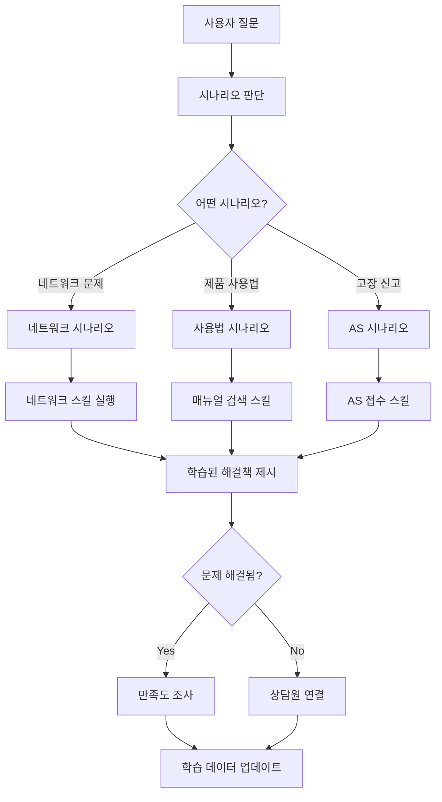

## 카카오톡 챗봇의 시나리오, 스킬, 학습 설명

### 1. 시나리오(Scenario) 📋

**시나리오**는 챗봇이 사용자와 대화하는 **전체적인 흐름과 구조**를 설계하는 것입니다.

#### 주요 특징:
- **대화 플로우 설계**: 사용자 입력 → 챗봇 응답 → 추가 질문/분기 → 해결 또는 종료
- **멀티턴 대화**: 여러 번의 대화를 통해 단계적으로 문제를 해결
- **분기 처리**: 사용자의 선택에 따라 다른 경로로 대화 진행

#### 다빛솔루션 AS 챗봇 시나리오 예시:
```
사용자: "WiFi 연결이 안 돼요"
   ↓
챗봇: "다른 기기는 같은 WiFi에 연결되나요?"
   ↓ [네/아니요] 버튼 선택
챗봇: 각 답변에 따른 맞춤형 해결책 제시
   ↓
단계별 문제 해결 과정
   ↓
해결 완료 or 상담원 연결
```

### 2. 스킬(Skill) ⚙️

**스킬**은 챗봇이 **특정 작업을 수행할 수 있는 개별 기능**을 의미합니다.

#### 다빛솔루션 제품 관련 스킬 예시:
- **제품 정보 조회**: 시리얼 번호로 제품 정보 확인
- **매뉴얼 검색**: 사용자 질문에 맞는 매뉴얼 부분 찾기
- **AS 접수**: 고장 신고 및 AS 일정 예약
- **설정 가이드**: 단계별 설정 방법 안내
- **프로토콜 안내**: ASCII 프로토콜, 통신 설정 등 기술 정보 제공
- **상담원 연결**: 복잡한 문제 시 실시간 상담 연결

#### 기술적 스킬:
- **외부 API 호출**: 제품 DB, AS 시스템 연동
- **파일 처리**: PDF 매뉴얼, 이미지 분석
- **지식 베이스 검색**: RAG(Retrieval Augmented Generation) 시스템 활용

### 3. 학습(Learning) 🧠

**학습**은 챗봇이 **사용자 상호작용을 통해 지속적으로 개선**되는 과정입니다.

#### 학습 데이터 종류:
- **DABIT DOCS 매뉴얼**: 제품 사용법, 기술 문서
- **유튜브 영상 스크립트**: 설명 영상의 음성을 텍스트로 변환
- **기존 AS 상담 이력**: 실제 고객 문의 패턴
- **FAQ 데이터**: 자주 묻는 질문과 답변

#### 학습 방법:
1. **RAG 기반 지식 베이스 구축**
   - 매뉴얼과 문서를 벡터 DB로 변환
   - 사용자 질문과 유사한 내용 실시간 검색

2. **대화 패턴 학습**
   - 사용자 발화 패턴 분석
   - 성공적인 문제 해결 케이스 학습

3. **지속적 개선**
   - 사용자 만족도 피드백 수집
   - 미처리 질문 분석 및 시나리오 보완

### 실제 구현 관계도



### 다빛솔루션 AS 챗봇의 차별화 포인트

1. **전문 기술 문의 대응**: 단순 FAQ가 아닌 전문적인 기술 지원
2. **제품별 맞춤 시나리오**: DB300, DB400 등 제품별 특화된 해결 과정
3. **멀티미디어 학습**: 매뉴얼(PDF) + 유튜브 영상 + 실제 상담 이력
4. **실시간 연동**: 제품 DB, AS 시스템과 실시간 연동

이러한 구조를 통해 고객이 24시간 언제든지 전문적인 기술 지원을 받을 수 있는 챗봇 시스템을 구축하는 것이 목표입니다.