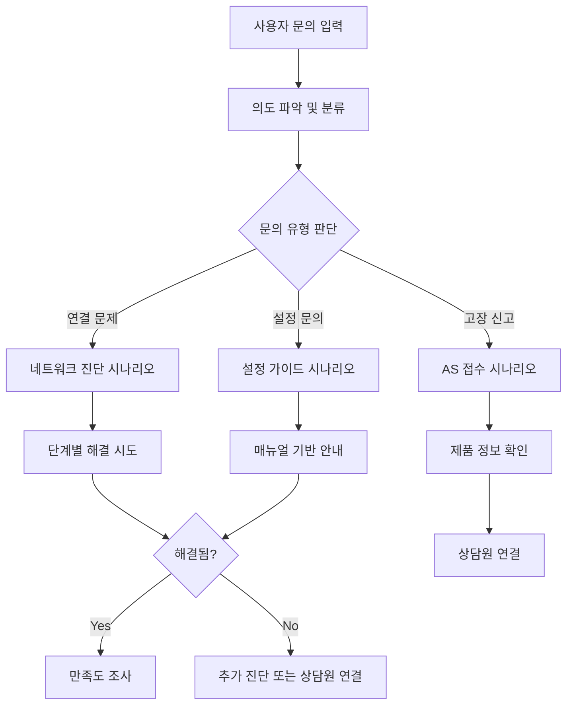

카카오톡 챗봇 제작을 위한 단계별 준비사항과 실제 제작 가이드를 상세히 작성해드리겠습니다.

[1 tool called]

# 카카오톡 챗봇 제작 완전 가이드

## 📋 1. 시나리오(Scenario) 준비 및 제작

### 1-1. 사전 준비사항

#### A. 고객 문의 패턴 분석
```markdown
✅ 준비할 것:
- 기존 AS 상담 이력 3-6개월치
- 고객센터 FAQ 리스트
- 제품별 주요 문의 유형 분류
- 상담원들의 응답 패턴 분석
```

#### B. 시나리오 카테고리 설정
```markdown
다빛솔루션 기준 주요 카테고리:
1. 제품 연결/설정 (WiFi, 블루투스, 이더넷)
2. 표출 신호 설정 (LED 모듈, 폰트, 이미지)
3. 통신 프로토콜 (ASCII, TCP/IP, RS485)
4. 하드웨어 문제 (전원, 디스플레이, 센서)
5. 소프트웨어 (펌웨어 업데이트, 다빛채 사용법)
6. AS 접수 및 문의
```

### 1-2. 시나리오 설계 실제 작업

#### A. 시나리오 플로우 차트 작성


#### B. 대화 스크립트 작성 템플릿
```markdown
📝 시나리오명: WiFi 연결 문제 해결

1. 트리거 키워드: 
   - "와이파이", "WiFi", "인터넷", "연결 안됨"

2. 대화 플로우:
   사용자: "WiFi 연결이 안 돼요"
   
   챗봇: "WiFi 연결 문제를 도와드리겠습니다! 
         먼저 다른 기기(스마트폰, 노트북)는 
         같은 WiFi에 정상 연결되나요?"
   
   선택지: [네, 잘 돼요] [아니요, 안 돼요]
   
   → [네, 잘 돼요] 선택 시:
     "제품만 연결이 안 되는 상황이군요. 
      제품 화면에 WiFi 아이콘이 보이시나요?"
     
   → [아니요, 안 돼요] 선택 시:
     "인터넷 자체에 문제가 있을 수 있습니다.
      공유기 전원을 5초간 끈 후 다시 켜보세요."

3. 해결 단계별 분기점 설계
4. 최종 해결 또는 에스컬레이션 경로
```

### 1-3. 카카오 오픈빌더에서 시나리오 구현

#### A. 블록 생성 및 연결
```markdown
🔧 실제 구현 단계:

1. 시나리오 생성
   - 오픈빌더 > 시나리오 > "새 시나리오 만들기"
   - 시나리오명: "WiFi_연결_문제_해결"

2. 엔티티 설정
   - @연결상태: {정상, 비정상, 모름}
   - @기기종류: {DB300, DB400, DB320WB}
   - @문제유형: {연결안됨, 느림, 끊김}

3. 인텐트 설정
   - "WiFi_연결_문의": 
     학습 예문: "와이파이가 안돼요", "인터넷 연결 문제"
     
4. 블록 설계
   - 시작 블록: 문제 확인
   - 분기 블록: 상황별 처리
   - 해결 블록: 단계별 가이드
   - 종료 블록: 완료 또는 상담원 연결
```

---

## ⚙️ 2. 스킬(Skill) 준비 및 제작

### 2-1. 사전 준비사항

#### A. 필요한 스킬 목록 정의
```markdown
✅ 다빛솔루션 핵심 스킬:

1. 제품정보조회 스킬
   - 시리얼 번호로 제품 사양 확인
   - 보증 기간 조회
   - 구매 이력 확인

2. 매뉴얼검색 스킬
   - PDF 매뉴얼에서 키워드 검색
   - 관련 페이지 번호 안내
   - 이미지/다이어그램 제공

3. 프로토콜안내 스킬
   - ASCII 프로토콜 예시 생성
   - BCC 계산 도구
   - 통신 설정 가이드

4. AS접수 스킬
   - 고장 증상 접수
   - 방문/택배 일정 조율
   - 접수번호 발급

5. 실시간상담연결 스킬
   - 상담원 대기 시간 확인
   - 콜백 예약
   - 긴급도 평가
```

#### B. 외부 연동 시스템 확인
```markdown
🔌 연동 필요 시스템:

1. 제품 데이터베이스
   - API 엔드포인트: /api/product/info
   - 인증 방식: API Key
   - 응답 형식: JSON

2. AS 관리 시스템
   - 접수: POST /api/as/create
   - 조회: GET /api/as/status/{id}
   - 일정: GET /api/as/schedule

3. 지식 베이스 (RAG)
   - 매뉴얼 검색: POST /api/search/manual
   - 유사 문의: GET /api/similar/cases
   - 해결책: GET /api/solution/{problem_id}
```

### 2-2. 스킬 개발 실제 작업

#### A. API 서버 개발 (Node.js/Python 예시)
```javascript
// 제품 정보 조회 스킬 예시 (Node.js)
app.post('/skill/product-info', async (req, res) => {
    const { serial_number } = req.body.action.params;
    
    try {
        // 제품 DB 조회
        const product = await ProductDB.findBySerial(serial_number);
        
        if (!product) {
            return res.json({
                response: {
                    outputSpeech: {
                        plainText: "해당 시리얼 번호로 제품을 찾을 수 없습니다. 다시 확인해 주세요."
                    }
                }
            });
        }
        
        const responseText = `
        제품 정보를 찾았습니다!
        
        📱 제품명: ${product.name}
        🏷️ 모델: ${product.model}
        📅 구매일: ${product.purchase_date}
        🛡️ 보증 기간: ${product.warranty_status}
        `;
        
        res.json({
            response: {
                outputSpeech: {
                    plainText: responseText
                },
                reprompt: {
                    plainText: "다른 도움이 필요하시면 말씀해 주세요."
                }
            }
        });
        
    } catch (error) {
        res.json({
            response: {
                outputSpeech: {
                    plainText: "시스템 오류가 발생했습니다. 잠시 후 다시 시도해 주세요."
                }
            }
        });
    }
});
```

#### B. 카카오 오픈빌더에서 스킬 연결
```markdown
🔧 스킬 등록 및 연결:

1. 스킬 서버 등록
   - 설정 > 스킬 서버 > "새 스킬 서버 추가"
   - URL: https://your-api-server.com/skill
   - 인증: Bearer Token 설정

2. 블록에서 스킬 호출
   - 블록 편집 > 스킬 응답 추가
   - 스킬명: "제품정보조회"
   - 파라미터: serial_number (사용자 입력)
   - 결과 처리: JSON 응답을 텍스트로 변환

3. 파라미터 수집 블록 설정
   - 엔티티: @시리얼번호 (정규식: [A-Z]{2}[0-9]{8})
   - 재확인: "시리얼 번호가 {{serial_number}}가 맞나요?"
```

---

## 🧠 3. 학습(Learning) 준비 및 제작

### 3-1. 사전 준비사항

#### A. 학습 데이터 수집
```markdown
✅ 수집할 데이터 목록:

1. DABIT DOCS 매뉴얼 (PDF → 텍스트)
   - 위치: d:/Staff/20. 브랜드마케팅팀/DabitDocs/
   - 변환 도구: PyPDF2, pdfplumber
   - 후처리: 텍스트 정제, 섹션별 분할

2. 유튜브 영상 스크립트
   - 음성 → 텍스트 변환 (Whisper API)
   - 영상별 주제 태깅
   - 타임스탬프와 함께 저장

3. 기존 상담 이력
   - 고객 문의 → 상담원 답변 페어
   - 개인정보 마스킹 처리
   - 문제 유형별 분류

4. FAQ 데이터
   - 기존 홈페이지/매뉴얼 FAQ
   - 질문 변형 패턴 생성
   - 답변 일관성 검토
```

#### B. 벡터 데이터베이스 구축 환경
```markdown
🛠️ 기술 스택 선택:

1. 벡터 DB 옵션:
   - Pinecone (클라우드, 유료)
   - Chroma (오픈소스, 로컬)
   - Qdrant (오픈소스, 도커)
   - FAISS (페이스북, 무료)

2. 임베딩 모델:
   - OpenAI text-embedding-ada-002
   - Cohere embed-multilingual-v3.0
   - 한국어 특화: KoSentenceBERT

3. 개발 환경:
   - Python 3.8+
   - LangChain 프레임워크
   - FastAPI (API 서버)
   - Docker (배포)
```

### 3-2. RAG 시스템 구축 실제 작업

#### A. 데이터 전처리 스크립트
```python
# 매뉴얼 PDF 처리 예시
import PyPDF2
import re
from langchain.text_splitter import RecursiveCharacterTextSplitter

def process_dabit_manual(pdf_path):
    # PDF 텍스트 추출
    with open(pdf_path, 'rb') as file:
        pdf_reader = PyPDF2.PdfReader(file)
        text = ""
        for page in pdf_reader.pages:
            text += page.extract_text()
    
    # 텍스트 정제
    cleaned_text = re.sub(r'\n+', '\n', text)
    cleaned_text = re.sub(r'\s+', ' ', cleaned_text)
    
    # 청크 분할
    text_splitter = RecursiveCharacterTextSplitter(
        chunk_size=500,
        chunk_overlap=50,
        separators=["\n\n", "\n", ".", "!", "?"]
    )
    
    chunks = text_splitter.split_text(cleaned_text)
    
    # 메타데이터 추가
    documents = []
    for i, chunk in enumerate(chunks):
        documents.append({
            'content': chunk,
            'metadata': {
                'source': pdf_path,
                'chunk_id': i,
                'type': 'manual'
            }
        })
    
    return documents
```

#### B. 벡터 DB 구축 및 검색
```python
from langchain.vectorstores import Chroma
from langchain.embeddings import OpenAIEmbeddings

class DabitKnowledgeBase:
    def __init__(self):
        self.embeddings = OpenAIEmbeddings(
            openai_api_key="your-api-key"
        )
        self.vectorstore = None
    
    def build_knowledge_base(self, documents):
        """지식 베이스 구축"""
        texts = [doc['content'] for doc in documents]
        metadatas = [doc['metadata'] for doc in documents]
        
        self.vectorstore = Chroma.from_texts(
            texts=texts,
            metadatas=metadatas,
            embedding=self.embeddings,
            persist_directory="./chroma_db"
        )
        
    def search_similar(self, query, k=5):
        """유사 문서 검색"""
        if not self.vectorstore:
            return []
            
        results = self.vectorstore.similarity_search(
            query, 
            k=k
        )
        
        return [
            {
                'content': doc.page_content,
                'metadata': doc.metadata,
                'relevance': 'high'  # 실제로는 점수 계산
            }
            for doc in results
        ]
```

---

## 🚀 4. 실제 제작 단계별 가이드

### 4-1. 1단계: 환경 설정 (1-2주)

```markdown
📋 체크리스트:

✅ 카카오 개발 환경
- [ ] 카카오톡 채널 생성
- [ ] OBT 신청 및 승인 대기
- [ ] 카카오 i 오픈빌더 접속 확인
- [ ] 테스트용 채널 별도 생성

✅ 개발 환경
- [ ] API 서버 호스팅 준비 (AWS/Azure/GCP)
- [ ] 도메인 및 SSL 인증서 설정
- [ ] 데이터베이스 서버 구축
- [ ] 백업 및 모니터링 시스템 구축

✅ 데이터 수집
- [ ] DABIT DOCS PDF 파일 정리
- [ ] 기존 상담 이력 익명화 처리
- [ ] 유튜브 영상 목록 정리
- [ ] FAQ 데이터 구조화
```

### 4-2. 2단계: 핵심 시나리오 구현 (3-4주)

```markdown
🔧 우선순위별 구현:

Week 1: 기본 시나리오
- [ ] 인사말 및 메뉴 안내
- [ ] 제품 정보 조회 (시리얼 번호)
- [ ] 상담원 연결 기능

Week 2-3: 주요 문의 시나리오
- [ ] WiFi/네트워크 연결 문제 (최우선)
- [ ] 전원/디스플레이 문제
- [ ] 기본 설정 가이드

Week 4: 고급 기능
- [ ] 프로토콜 안내
- [ ] AS 접수 자동화
- [ ] 매뉴얼 검색
```

### 4-3. 3단계: 스킬 개발 및 연동 (4-5주)

```markdown
🛠️ 개발 순서:

Phase 1: 기본 스킬 (2주)
- [ ] 제품 정보 조회 API
- [ ] 간단한 매뉴얼 검색
- [ ] AS 접수 폼 연동

Phase 2: AI 기반 스킬 (2주)
- [ ] RAG 기반 지식 검색
- [ ] 자연어 처리 의도 파악
- [ ] 유사 문의 추천

Phase 3: 고도화 (1주)
- [ ] 실시간 상담 연결
- [ ] 만족도 조사 자동화
- [ ] 사용 통계 수집
```

### 4-4. 4단계: 학습 데이터 구축 (2-3주)

```markdown
📚 데이터 구축 프로세스:

Week 1: 데이터 수집 및 전처리
- [ ] PDF 매뉴얼 텍스트 변환
- [ ] 유튜브 영상 스크립트 추출
- [ ] 상담 이력 데이터 정제

Week 2: 벡터 DB 구축
- [ ] 임베딩 모델 선택 및 테스트
- [ ] 청크 분할 최적화
- [ ] 벡터 DB 구축 및 인덱싱

Week 3: 검색 성능 최적화
- [ ] 검색 정확도 테스트
- [ ] 파라미터 튜닝
- [ ] A/B 테스트 설계
```

### 4-5. 5단계: 테스트 및 배포 (2-3주)

```markdown
🧪 테스트 프로세스:

Week 1: 내부 테스트
- [ ] 기능별 단위 테스트
- [ ] 시나리오 플로우 테스트
- [ ] 에러 케이스 검증

Week 2: 베타 테스트
- [ ] 사내 직원 대상 테스트
- [ ] 주요 고객 대상 베타 테스트
- [ ] 피드백 수집 및 분석

Week 3: 정식 배포
- [ ] 운영 환경 배포
- [ ] 모니터링 시스템 가동
- [ ] 고객 공지 및 홍보
```

---

## 📊 성과 측정 및 지속 개선

### 주요 KPI 설정
```markdown
📈 측정 지표:

1. 사용성 지표
   - 챗봇 응답률: 80% 이상
   - 평균 해결 시간: 5분 이내
   - 상담원 연결률: 20% 이하

2. 만족도 지표
   - 고객 만족도: 4.0/5.0 이상
   - 재사용률: 60% 이상
   - 추천 의향: 70% 이상

3. 비즈니스 지표
   - 상담 비용 절감: 40% 이상
   - 24시간 대응률: 100%
   - 반복 문의 감소: 50% 이상
```

이렇게 단계적으로 접근하면 효과적인 AS 기술문의 챗봇을 구축할 수 있습니다. 각 단계마다 충분한 검증과 피드백 수집이 중요합니다.

[1 tool called]