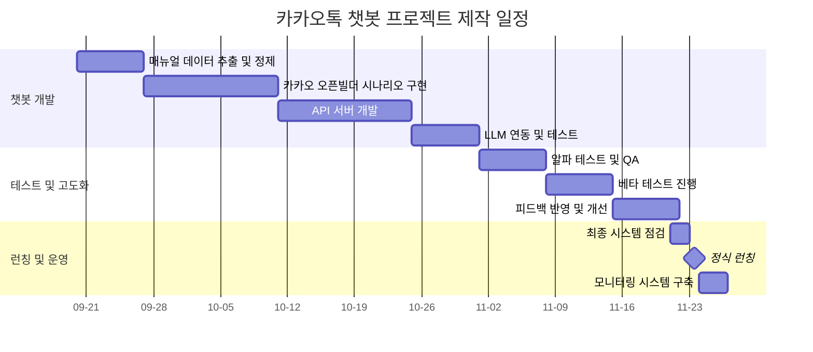

### 기술 스택
- **Backend:** Python 3.13.7 + Flask 3.0.3
- **AI:** Google Gemini 2.0 Flash
- **배포:** Railway (자동 배포)
- **버전관리:** GitHub

### 주요 기능 구현
- 서버 상태 확인 API
- AI 의도 분류 (제품문의/사용법/고장AS/견적구매)
- 카카오톡 응답 형식 템플릿
- 환경변수 관리
- 에러 핸들링

### 배포 현황
- 프로덕션 서버: https://web-production-33051.up.railway.app/
- 자동 배포 설정: GitHub push → Railway 자동 재배포