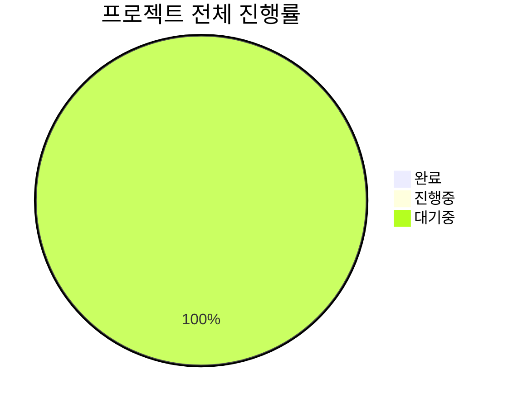

# 카카오톡 챗봇 프로젝트 칸반 보드

> 프로젝트 작업을 단계별로 관리할 수 있는 칸반 보드

---

## 📋 작업 현황 개요

| 단계 | 진행중 | 완료 | 전체 | 완료율 |
|------|--------|------|------|--------|
| **기획 및 환경설정** | 0 | 0 | 8 | 0% |
| **유튜브 콘텐츠** | 0 | 0 | 6 | 0% |
| **챗봇 개발** | 0 | 0 | 12 | 0% |
| **테스트 및 고도화** | 0 | 0 | 8 | 0% |
| **런칭 및 운영** | 0 | 0 | 4 | 0% |
| **전체** | 0 | 0 | 38 | 0% |

---

## 🚀 To Do (할 일)

### 1단계: 기획 및 초기 환경 설정
- [ ] **챗봇 목표 및 범위 설정**
  - 처리할 AS 문의 유형 구체화
  - 챗봇 역할과 한계 명확화
  - 우선순위 문의 유형 선정
  - **마감일**: 2025-08-03
  - **담당자**: 마케팅팀
  - **우선순위**: High

- [ ] **주요 시나리오 정의**
  - FAQ 10-20개 선정
  - 대화 흐름 초안 작성
  - 인텐트 및 엔티티 정의
  - **마감일**: 2025-08-05
  - **담당자**: 마케팅팀
  - **우선순위**: High

- [ ] **카카오톡 채널 생성**
  - 채널 개설 및 기본 설정
  - 프로필 이미지 및 소개 설정
  - **마감일**: 2025-08-07
  - **담당자**: 마케팅팀
  - **우선순위**: High

- [ ] **OBT 신청 및 승인**
  - 카카오 디벨로퍼스 계정 연동
  - OBT 신청서 작성 및 제출
  - **마감일**: 2025-08-10
  - **담당자**: 마케팅팀
  - **우선순위**: Critical

- [ ] **학습 데이터 수집 전략 수립**
  - 데이터 소스 목록화
  - 수집 방법 및 도구 선정
  - **마감일**: 2025-08-12
  - **담당자**: R&D팀
  - **우선순위**: Medium

- [ ] **카카오 i 오픈빌더 초기 설정**
  - 기본 구조 이해
  - 테스트 블록 생성
  - **마감일**: 2025-08-14
  - **담당자**: R&D팀
  - **우선순위**: Medium

### 2단계: 유튜브 영상 업로드
- [ ] **AS 관련 영상 리스트업**
  - DABIT DOCS 기준 핵심 영상 선정
  - 제작 우선순위 결정
  - **마감일**: 2025-08-16
  - **담당자**: 마케팅팀
  - **우선순위**: High

- [ ] **핵심 영상 제작**
  - 설치 가이드 영상
  - 오류 해결 영상
  - 제품 사용법 영상
  - **마감일**: 2025-08-30
  - **담당자**: 마케팅팀
  - **우선순위**: High

- [ ] **영상 업로드 및 최적화**
  - 유튜브 채널 업로드
  - 제목, 설명, 태그 최적화
  - **마감일**: 2025-09-11
  - **담당자**: 마케팅팀
  - **우선순위**: High

- [ ] **스크립트 추출 준비**
  - STT 도구 선정
  - 추출 프로세스 설계
  - **마감일**: 2025-09-11
  - **담당자**: R&D팀
  - **우선순위**: Medium

---

## 🔄 In Progress (진행중)

*현재 진행중인 작업이 없습니다.*

---

## ✅ Done (완료)

*완료된 작업이 없습니다.*

---

## 🚫 Blocked (차단됨)

*차단된 작업이 없습니다.*

---

## 📊 주간 작업 계획

### Week 1 (8/1-8/7)
**목표**: 프로젝트 기획 완료 및 카카오 환경 구축
- [ ] 챗봇 목표 및 범위 설정
- [ ] 주요 시나리오 정의
- [ ] 카카오톡 채널 생성

### Week 2 (8/8-8/14)
**목표**: OBT 승인 및 개발 환경 준비
- [ ] OBT 신청 및 승인
- [ ] 학습 데이터 수집 전략 수립
- [ ] 카카오 i 오픈빌더 초기 설정

### Week 3-4 (8/15-8/28)
**목표**: 유튜브 콘텐츠 제작 시작
- [ ] AS 관련 영상 리스트업
- [ ] 핵심 영상 제작 (1차)

### Week 5-6 (8/29-9/11)
**목표**: 유튜브 콘텐츠 완성
- [ ] 핵심 영상 제작 (2차)
- [ ] 영상 업로드 및 최적화
- [ ] 스크립트 추출 준비

---

## 🎯 이번 주 우선순위 작업

### High Priority
1. **챗봇 목표 및 범위 설정** (마감: 8/3)
2. **주요 시나리오 정의** (마감: 8/5)
3. **카카오톡 채널 생성** (마감: 8/7)

### Medium Priority
1. **학습 데이터 수집 전략 수립** (마감: 8/12)
2. **카카오 i 오픈빌더 초기 설정** (마감: 8/14)

### Critical
1. **OBT 신청 및 승인** (마감: 8/10)

---

## 📈 진행률 추적

---

## 🔗 관련 문서

- [[카카오톡 챗봇 프로젝트 일정|일정 대시보드]]
- [[카카오톡 챗봇 프로젝트 개요|프로젝트 개요]]
- [[제작 일정 상세|상세 제작 일정]]

---

## 📝 사용 가이드

### 작업 상태 변경 방법
1. `[ ]` → `[x]` : 작업 완료
2. 작업을 다른 섹션으로 이동
3. 진행률 업데이트

### 우선순위 표시
- **Critical**: 즉시 처리 필요
- **High**: 높은 우선순위
- **Medium**: 보통 우선순위
- **Low**: 낮은 우선순위

### 마감일 관리
- 마감일이 임박한 작업은 빨간색으로 표시
- 지연된 작업은 별도 추적 필요

---

*이 칸반 보드는 매일 업데이트되며, 팀원들과 실시간으로 공유됩니다.*

