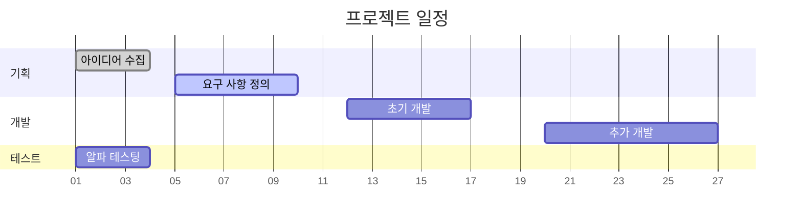
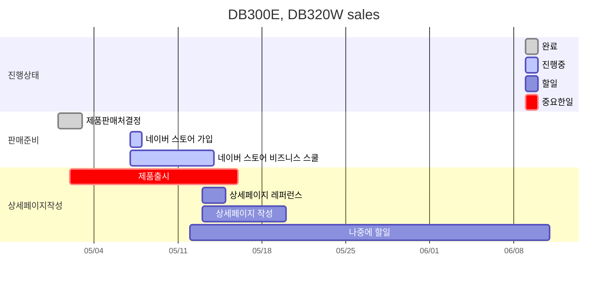
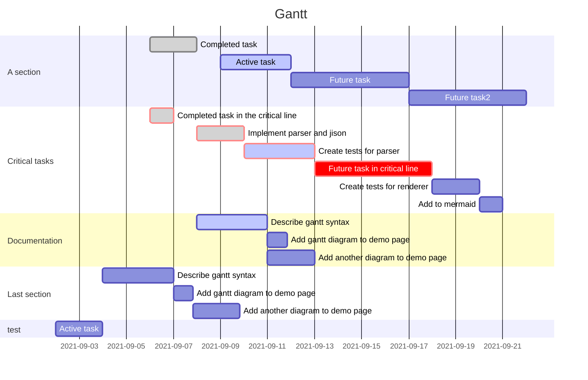

- Gantt
	- https://olait.tistory.com/10
	- https://kaminik.tistory.com/entry/%EC%98%B5%EC%8B%9C%EB%94%94%EC%96%B8-%EC%8B%AC%ED%99%94-Mermaid
	- 

출처: [https://olait.tistory.com/10](https://olait.tistory.com/10) [이토록 쉬운 옵시디언:티스토리]